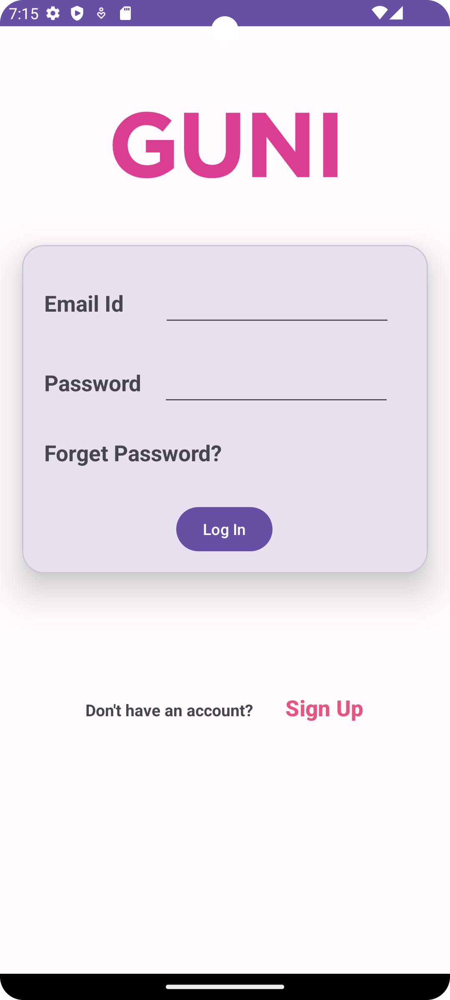

# Practical 3 - ConstraintLayout UI

**Submitted By:** MAKWANA SWASTIK PRAVIN

**Enrollment Number:** 21012011046

## Aim

The aim of this practical is to create a user interface (UI) using ConstraintLayout in Android.

## Project Structure

This project includes two main files:

### `activity_main.xml`

```xml
<?xml version="1.0" encoding="utf-8"?>
<androidx.constraintlayout.widget.ConstraintLayout xmlns:android="http://schemas.android.com/apk/res/android"
    xmlns:app="http://schemas.android.com/apk/res-auto"
    xmlns:tools="http://schemas.android.com/tools"
    android:layout_width="match_parent"
    android:layout_height="match_parent"
    tools:context=".MainActivity">

    <!-- Top Image View -->
    <ImageView
        android:id="@+id/imageView"
        android:layout_width="match_parent"
        android:layout_height="200dp"
        app:layout_constraintStart_toStartOf="parent"
        app:layout_constraintTop_toTopOf="parent"
        app:srcCompat="@drawable/guni_pink_logo" />

    <!-- "Don't have an account?" TextView -->
    <TextView
        android:id="@+id/textView7"
        android:layout_width="wrap_content"
        android:layout_height="wrap_content"
        android:text="Don't have an account?"
        android:textSize="15dp"
        android:textStyle="bold"
        app:layout_constraintBaseline_toBaselineOf="@+id/button2"
        app:layout_constraintEnd_toEndOf="parent"
        app:layout_constraintHorizontal_bias="0.302"
        app:layout_constraintStart_toStartOf="parent" />

    <!-- "Sign Up" Button -->
    <Button
        android:id="@+id/button2"
        android:layout_width="wrap_content"
        android:layout_height="wrap_content"
        android:text="Sign Up"
        android:backgroundTint="#00F4C2C2"
        android:textColor="#e75480"
        app:rippleColor="#FFC0CB"
        app:strokeColor="#AB1F1F"
        android:textSize="20dp"
        android:textStyle="bold"
        app:layout_constraintBottom_toBottomOf="parent"
        app:layout_constraintEnd_toEndOf="parent"
        app:layout_constraintHorizontal_bias="0.088"
        app:layout_constraintStart_toEndOf="@+id/textView7"
        app:layout_constraintTop_toBottomOf="@+id/materialCardView"
        app:layout_constraintVertical_bias="0.311" />

    <!-- Material Card View -->
    <com.google.android.material.card.MaterialCardView
        android:id="@+id/materialCardView"
        android:layout_width="match_parent"
        android:layout_height="300dp"
        android:layout_marginHorizontal="20dp"
        app:cardCornerRadius="20dp"
        app:cardElevation="20dp"
        app:layout_constraintStart_toStartOf="parent"
        app:layout_constraintTop_toBottomOf="@id/imageView">

        <androidx.constraintlayout.widget.ConstraintLayout
            android:layout_width="match_parent"
            android:layout_height="match_parent">

            <!-- "Password" TextView -->
            <TextView
                android:id="@+id/textView"
                android:layout_width="wrap_content"
                android:layout_height="wrap_content"
                android:layout_marginStart="20dp"
                android:text="Password"
                android:textSize="20sp"
                android:textStyle="bold"
                app:layout_constraintBaseline_toBaselineOf="@+id/password_toggle"
                app:layout_constraintStart_toStartOf="parent" />

            <!-- "Email Id" TextView -->
            <TextView
                android:id="@+id/textView2"
                android:layout_width="wrap_content"
                android:layout_height="wrap_content"
                android:layout_marginStart="20dp"
                android:text="Email Id"
                android:textSize="20sp"
                android:textStyle="bold"
                app:layout_constraintBaseline_toBaselineOf="@+id/editTextTextEmailAddress"
                app:layout_constraintStart_toStartOf="parent" />

            <!-- "Forget Password?" TextView -->
            <TextView
                android:id="@+id/textView3"
                android:layout_width="wrap_content"
                android:layout_height="wrap_content"
                android:layout_marginStart="20dp"
                android:text="Forget Password?"
                android:textSize="20sp"
                android:textStyle="bold"
                app:layout_constraintBottom_toBottomOf="parent"
                app:layout_constraintStart_toStartOf="parent"
                app:layout_constraintTop_toBottomOf="@+id/textView"
                app:layout_constraintVertical_bias="0.275" />

            <!-- "Log In" Button -->
            <Button
                android:id="@+id/btnclick"
                android:layout_width="wrap_content"
                android:layout_height="wrap_content"
                android:text="Log In"
                app:layout_constraintBottom_toBottomOf="parent"
                app:layout_constraintEnd_toEndOf="parent"
                app:layout_constraintHorizontal_bias="0.498"
                app:layout_constraintStart_toStartOf="parent"
                app:layout_constraintTop_toBottomOf="@+id/textView3"
                app:layout_constraintVertical_bias="0.666" />

            <!-- Email EditText -->
            <EditText
                android:id="@+id/editTextTextEmailAddress"
                android:layout_width="wrap_content"
                android:layout_height="wrap_content"
                android:layout_marginTop="32dp"
                android:ems="10"
                android:inputType="textEmailAddress"
                app:layout_constraintEnd_toEndOf="parent"
                app:layout_constraintHorizontal_bias="0.514"
                app:layout_constraintStart_toEndOf="@+id/textView2"
                app:layout_constraintTop_toTopOf="parent" />

            <!-- Password EditText -->
            <EditText
                android:id="@+id/password_toggle"
                android:layout_width="wrap_content"
                android:layout_height="wrap_content"
                android:ems="10"
                android:inputType="textEmailAddress"
                app:layout_constraintBottom_toBottomOf="parent"
                app:layout_constraintEnd_toEndOf="parent"
                app:layout_constraintHorizontal_bias="0.507"
                app:layout_constraintStart_toEndOf="@+id/textView2"
                app:layout_constraintTop_toBottomOf="@+id/editTextTextEmailAddress"
                app:layout_constraintVertical_bias="0.157" />

        </androidx.constraintlayout.widget.ConstraintLayout>

    </com.google.android.material.card.MaterialCardView>

</androidx.constraintlayout.widget.ConstraintLayout>
```

### `MainActivity.kt`

```kotlin
package com.example.practical3_46

import androidx.appcompat.app.AppCompatActivity
import android.os.Bundle

class MainActivity : AppCompatActivity() {
    override fun onCreate(savedInstanceState: Bundle?) {
        super.onCreate(savedInstanceState)
        setContentView(R.layout.activity_main)
    }
}
```

## Description

This project demonstrates the creation of a user interface using ConstraintLayout in Android. The layout contains various UI elements, including an ImageView, TextViews, EditTexts, and a Button. It provides a sample login page with a sign-up option and a forget password link.

The UI is designed using ConstraintLayout, allowing

 for flexible and responsive positioning of elements. The XML layout (`activity_main.xml`) defines the structure and constraints of the UI components, while the Kotlin code (`MainActivity.kt`) sets the content view to the layout.

Feel free to use and modify this code as a starting point for your Android app UI development.
## Screenshot


